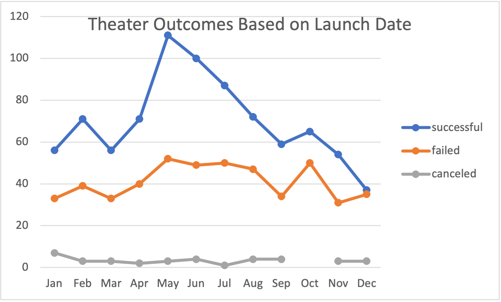
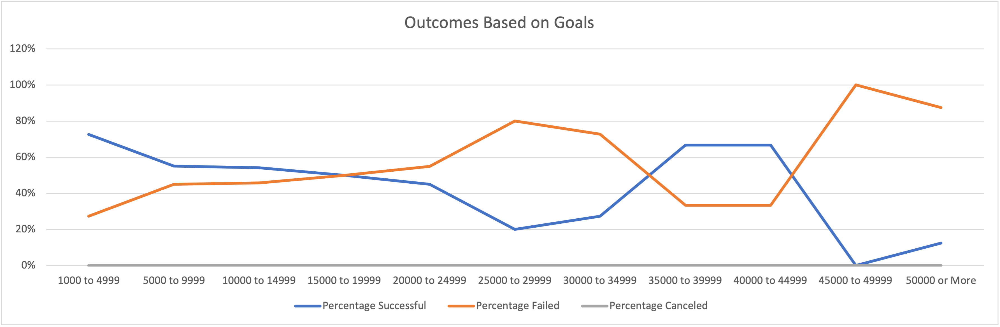

# Kickstarting with Excel-Challenge
Excel Project for Analyzing Kickstarter Data

## Overview
For this assignment, I used a variety of methods to gather data from a large data sheet consisting of thousands of kickstarter campaigns from around the world.

## Purpose
Gathering data from kickstarters all over the world can help us assist Louise, a rising playwright, who is attempting a crowdfunding campaign for her play _Fever_. She is estimating the budget for her play will be about ten thousand dollars and she is hesitant about jumping in. This will be her first crowdfunding campaign so she requests my assistance in uncovering trends on a large data sheet. This data sheet can assist me in finding patters in order to find out the best conditions for Louise play to be a success. Once these trends are discovered, I can assist Louise by showing her what factors caused the play to be successful so then she can mirror them to have the best possible outcome.

## Analysis and Challenges
### Analysis of Outcomes Based on Launch Date
For Deliverable 1, I had to look for some factors that made plays successful around the world. Such factors include the goals, the amount pledged, the outcomes of the plays, as well as where the plays were located around the globe. Since the data sheet is very large due to all of the different kickstarters for other fields such as animation and hardware, I filtered all the campaigns to only show plays in the data sheet. This helped get rid of the majority of data that was not needed for this assignment. I then made a pivot table with the condensed data from the original data sheet. With this pivot table, I placed Years and the parent category (theater) to the filters section. I then put the months into rows as well as made columns to show the amount of plays that were  successful, failures, and cancelled. After the pivot table was fully set up, I made a line chart that shows the time frame of when plays were successful, failed or canceled. 

### Analysis of Outcomes Based on Goals
For Deliverable 2, I was informed that Louise's goal for her play _Fever_ would be $10,000. With this information, I began to make a separate graph containing the rate at which plays either succeeded, failed, or were canceled based on their goal. I first made some rows showing the various goal ranges (for example, showing campaigns that were less than $1,000 and another row being from $1,000 to $4,999 and so on). I then made columns that would display the amount of campaigns that were successful, failures, or if they were canceled. I finished the columns by adding "Total Projects" to show how many plays asked for their respective goals as well as columns representing the Percentage of Success, Failure, and Cancelation. Next, I used the COUNTIF formula in order to populate the columns to show how many plays had goals within the range of rows I displayed earlier. In order to do this, I first went to the Kickstarter worksheet, and I filtered the Subcategory in column R to show only "plays". Then, I went back to the Outcomes Based on Goals worksheet and applied the COUNTIF formula.  Using the COUNTIF formula, I gathered data from columns D (showing the goals), F (showing the outcomes), and R (showing the plays) in order to get the amount of plays that were successful, failures, and those that were canceled. In order to complete the Total Projects Column, I used the SUM formula to add up columns of Successful, Failed, and Canceled number of projects. In order to calculate the percentages of successes, failures and cancellations, I simply divided the number of successful projects by the total projects and changed the format to Percentage. I did the same with the failed and canceled projects. To finish the section, I highlighted my data and created a line graph and added the title to show the Outcomes Based on Goals.

### Challenges and Difficulties Encountered
In the beginning of making the pivot table, I did have a little bit of trouble making sure all of the data was in the pivot table. What I did first to make the pivot table was use my cursor to drag and highlight all the data i needed fro. the filtered subcategory. When I selected the entire data sheet using this method, I was able to make a pivot table, but I had an issue where I had some data as "(blank)". This (blank) portion had no data and it drastically changed the look of my graph as well when I decided to make a graph for it. I had a feeling this was not right since it was difficult to read the chart in the first place. I then looked back at my Kickstarter data sheet and I tried a different method. What I did was Command (since I have a Mac), Shift, and the left key to select all the data that was there to the left and then did Command, Shift, and the down arrow to get all the data from top to bottom without any blanks from the whole data sheet itself. When I made the pivot tale this time, I saw no (blank) portion. I then made the appropriate changes to the picot table to show the data that was requested from the Module. I then made a graph for the data and it was readable and it resembled what was requested.
When it comes to the second deliverable, the only challenge I had was a small one. Even though I had the correct data shown on the line graph, my x and y axis were displaying incorrect data. My x-axis was displaying the numbers 1-12 while my y-axis displayed the percentages but not in their correct form (they did not have the percent sign next to them and were only numbers). I realized my mistake when I looked at my graph and I accidentally did not highlight the right portions of my data. I highlighted everything but my goals which caused my x-axis to display numbers 1-12 with no context. With my y-axis, all I had to do was change the data values to percent from number. This fixed my graph which now resembled the instructions and i confirmed that they looked the same. One thing to take away from this is that it is best to make sure you go over all the data carefully to make sure everything is where it should be and is set to the right value. It is also the responsibility of the analyzer to make sure the are selecting the right data so its important to retrace your steps to make sure nothing is missed or forgotten about. 

## Results
-What are two conclusions you can draw based about the Outcomes Based on Launch Date?
When looking at the line graph based on the pivot table, the first thing I noticed was the fact that the success rate was much higher in the summer. The months of May, June and July showed the highest rate of success with 75 plays being successful in May, 101 plays in June, and 105 in July. So in order to Louise's play to have a higher chance for success during the year, she would need to have her play debut either in May, June, or July. Another trend I noticed was that after the summer months (July specifically), the success rate of plays began to drop down drastically. In July, the success rate was at its highest peak with 105 successful plays and from August to December, the number of plays continued to drop to almost half in December (52 successful plays).

-What can you conclude about the outcomes based on Goals?
According to the Outcomes Based on Goals sheet, one conclusion that can be made is the fact that plays with goals that are set too high can result in the failure of the campaign itself. We first get  glimpse of the rising failure rate when the goal is from $5,000 to $30,000. For example, plays with campaign goals that are in the $30,000 - $34,999 experience a failure rate of 73%. For Louise's play _Fever_, she asked for $10,000 and based on the graph, campaigns that are around $10,000 have a 45% failure rate which can be risky. There are some discrepancies in the $35,000 - $49,000 goal ranges but it is still a third of the plays that can fail which is not a small percentage. A large example can be seen in plays with a goal of over $50,000 in which out of the 16 campaigns, only two were successful while 14 failed. Another result I noticed was that plays with a smaller crowdfunding goal have a much better percentage of success. An example can be seen in plays that had a less than $1,000 goal. The failure rate is at 24% with the success rate being 76% and the same can be said for plays with a range of $1,000 - $4,999 with a success rate of 73% and 27% failure rate. 

-What are some limitations of this dataset?
One of the limitations of this dataset is the fact that we are unable to view multiple variables of data at once. For example, in this Module, we looked specifically at plays in the theater category. While looking at one parent and sub category, we were able to produce accurate and easy to read data to represent successful, failed, and canceled kickstarters based on their goals and launch date. Even though we were able to hone in on one crowdfunding campaign type, if we tried to look at different fields of campaigns to compare their success rates for example, the data would be altered to a great degree. I believe this is because Excel tries to juggle multiple data points at once and tries to fit it in one sheet and graph to provide for easier viewing. 
 
Another limitation I found in the dataset is simply the fact that we are unable to check past trends based on campaigns done in the past as well as in our current time. The data set for the theater category only goes back to 2010. And in terms of the future the most recent kickstarter for what we are looking for only goes up to 2017. Since I was tasked with helping Louise figure out trends for kickstarter campaigns I believe this data set could be much more accurate in terms of looking at data from this current and recent years as well after 2017. I also think it would be much more helpful if we were also able to look at past trends to see how things changed (if they did at all). I believe comparing the past to the present can really help in discovering any changes to trends so we can provide more accurate representations for the success or failure of the campaigns.  

-What are some other possible tables and/or graphs that we can create?
Another way we can look at the data in a clear way is by using a bar chart. We can have the percentages (on the y-axis (like with the line graph) and the goal ranges on the x-axis. Since we have both successful and failed campaigns, there will be two bars standing side by side per goal range. Since we are also looking at three different outcomes (successful, failed and canceled) we can see each outcome color coded. Since there were no canceled plays there is no canceled value in the bar chart. With this type of chart we can see how much each campaign was successful (or failed) by. 

-Conclusion 

